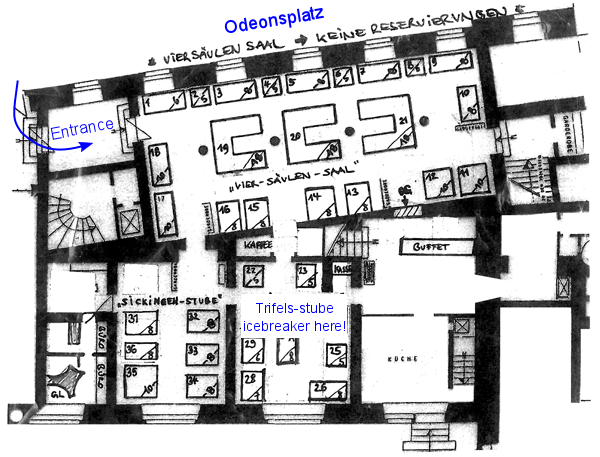

Title: Hum workshop - Munich, September 12, 2014
Slug: WShum
Authors: Heiner Igel

The Earth continuously hums a tune, at very low frequencies, audible only to 
sensitive geophysical instruments. The origin of this background seismic noise has 
been accredited to oceanic and atmospheric effects, although the exact mechanism is still 
not understood. Moreover, recent observations have shown that the Earth does not only vibrate 
in the vertical direction, but also exhibits a twisting motion, the so-called toroidal modes. 
The development and installation of a novel rotational sensor, currently underway at the LMU, 
will allow us to more closely study the toroidal modes which contribute to the Earth's Hum. 

The aim of the workshop is to discuss recent developments in the observation and explanation 
of the Earth's Hum. An international group of researchers will be brought together to provide 
insights on possible excitation mechanisms as well as improved observation strategies. 

Prof. Toshiro Tanimoto is one of the leading experts on the topic of the Earth's Hum and a keynote speaker. 
He will be visiting the Seismology department at LMU in September and October supported by a CAS fellowship.  

During the workshop, two main questions will be addressed: 

  

#### Where does the hum come from?
- What is the location of generation areas of vertical hum?
- What are possible generation mechanisms of vertical hum?
- Are they the same or different for horizontal hum? For rotations?

#### How can we best observe the hum?
- What can be gained by the combination with other observables? 
- What to look out for when developing processing schemes (spectral, time domain, .. )?
- How can we best observe horizontal (rotational) hum?

  

### Program
---
#### Thursday, September 11
We will welcome you on Thursday evening from 18:00 with an icebreaker (location further down). The scientific program starts on Friday.

 
#### Friday, September 12

8:55 - 9:00  Welcome by Prof. Dr. Heiner Igel

9:00 – 9:45  Prof. Dr. Toshiro Tanimoto: The origin of the hum [(PDF)](../docs/Toshiro_Tanimoto.pdf)

9:45 – 10:30 Dr. Fabrice Ardhuin: How ocean waves rock the Earth: two mechanisms explain seismic noise with periods 3 to 300 s

10:30 – 11:00 Coffee break

11:00 – 11:20 Dr. Dieter Kurrle: Observation of the horizontal Hum

11:20 – 11:40 Rolf H&auml;fner: Numerical simulation of hum excitation in an ocean with bathymetry [(PDF)](../docs/Rolf_Haefner.pdf)

11:40 – 12:00 Prof. Dr. Rudolf Widmer-Schnidrig: The 1991 Mount Pinatubo eruption - and why the atmosphere contributes to the excitation of the Hum. [(PDF)](../docs/Rudolf_Widmer-Schnidrig.pdf)

12:00 – 12:20 Prof. Dr. Walter Z&uuml;rn: Deterministic atmospheric effects in the Hum-band. [(PDF)](../docs/Walter_Zuern.pdf)

12:30 – 14:00 Lunch

14:00 – 14:30 Dr. Andr&eacute; Gebauer: High bandwidth ring laser observations in geodesy and geophysics [(PDF)](../docs/Andre_Gebauer.pdf)

14:30 – 15:00 Maria Fernanda Nader-Nieto: Normal mode coupling observations with a rotation sensor [(PDF)](../docs/Maria_Nader-Nieto.pdf)

15:00 – 15:30 Prof. Dr. Heiner Igel: The ROMY project - Towards stable broadband observations of rotational motions [(PDF)](../docs/Heiner_Igel.pdf)

15:30 – 17:00 Coffee break with informal poster session

17:00 Discussion moderated by Prof. Dr. Elenore Stutzmann

19:00 Dinner in town 

---

### Location

The workshop will take place in the building of the [Center for Advanced Studies (CAS)](http://www.en.cas.uni-muenchen.de/about_us/index.html): Seestrasse 13, Munich

<iframe width="425" height="350" frameborder="0" scrolling="no" marginheight="0" marginwidth="0" src="https://maps.google.com/maps?f=q&amp;source=s_q&amp;hl=en&amp;geocode=&amp;q=Seestra%C3%9Fe+13+80802+Munich&amp;aq=&amp;sll=37.0625,-95.677068&amp;sspn=52.77044,82.529297&amp;ie=UTF8&amp;hq=&amp;hnear=Seestra%C3%9Fe+13,+Schwabing-Freimann+80802+M%C3%BCnchen,+Germany&amp;t=m&amp;z=14&amp;ll=48.158793,11.590317&amp;output=embed"></iframe> <small><a href="https://maps.google.com/maps?f=q&amp;source=embed&amp;hl=en&amp;geocode=&amp;q=Seestra%C3%9Fe+13+80802+Munich&amp;aq=&amp;sll=37.0625,-95.677068&amp;sspn=52.77044,82.529297&amp;ie=UTF8&amp;hq=&amp;hnear=Seestra%C3%9Fe+13,+Schwabing-Freimann+80802+M%C3%BCnchen,+Germany&amp;t=m&amp;z=14&amp;ll=48.158793,11.590317" style="color:#0000FF;text-align:left">View Larger Map</a></small>

  

### Icebreaker

<iframe width="425" height="350" frameborder="0" scrolling="no" marginheight="0" marginwidth="0" src="https://maps.google.de/maps?client=opera&amp;oe=utf-8&amp;channel=suggest&amp;ie=UTF8&amp;fb=1&amp;gl=de&amp;sll=48.141783,11.577953&amp;sspn=0.0219934,0.0439462&amp;cid=574362365487061064&amp;q=pf%C3%A4lzer+weinstube+m%C3%BCnchen&amp;hq=&amp;hnear=&amp;ll=48.141783,11.577953&amp;spn=0.006295,0.006295&amp;t=m&amp;output=embed"></iframe> <small><a href="https://maps.google.de/maps?client=opera&amp;oe=utf-8&amp;channel=suggest&amp;ie=UTF8&amp;fb=1&amp;gl=de&amp;sll=48.141783,11.577953&amp;sspn=0.0219934,0.0439462&amp;cid=574362365487061064&amp;q=pf%C3%A4lzer+weinstube+m%C3%BCnchen&amp;hq=&amp;hnear=&amp;ll=48.141783,11.577953&amp;spn=0.006295,0.006295&amp;t=m&amp;source=embed" style="color:#0000FF;text-align:left">View Larger Map</a></small>

The icebreaker will take place on Thursday evening in the “Pfälzer Residenz Weinstube”. The restaurant is right next to subway station “Odeonsplatz”, accessible by lines U3, U4, U5 and U6. You are welcome to join us for a glass of wine starting from 18:00 in the "Trifels Stube" – shown on the small map below.

  

        

  

### Registration
Registration is now closed. 

There will be no registration fee. However, we kindly ask the participants to cover the dinner on Friday on their own.
  

#### Accommodation
For a list of nearby hotels and lodging agencies, please, click [here](http://www.geophysik.uni-muenchen.de/welcome/accommodations?set_language=en).

  

### Contact & Organisation

For any questions concerning the workshop, please <a href="mailto:hadzii@geophysik.uni-muenchen.de">contact us</a>.

<b>Organised by:</b>  
Prof. Dr. Heiner Igel 
Dr. C&eacute;line Hadziioannou 
Dr. Stefanie Donner  
  

