Title: News
Slug: news
Authors: Heiner Igel

#### <small>April, 2017 </small> New articles in insightLMU and photonworld

[The international newsletter of the LMU Munich](http://www.en.uni-muenchen.de/news/insightlmu/index.html) has published an article about the ROMY project with the title [A Revolution in Seismology?](http://www.en.uni-muenchen.de/news/insightlmu/2017/insight_01.pdf).

Also, [photonworld](https://photonworld.de/en.html), a platform dedicated to the physics of light, has published an article with the title [Ein Beben-Messer aus Licht](https://photonworld.de/nc/de/magazin/artikel/ein-beben-messer-aus-licht/aseite/1.html) (in German).

 

#### <small>April 2017 </small> Romy at EGU

Again, there will be a special session on *New developments in seismic and geodetic instrumentation (SM 5.2)* at the [EGU General Assembly](http://www.egu2017.eu/) from 23 to 28 April in Vienna. In addition, the members of the Romy group have submitted several contributions related to the ROMY project:

* Schreiber et al. - Integration and initial operation of the multi-component large ring laser structure ROMY (EGU 2017-5628)
* Gebauer et al. - Design and construction of a large 4C ring laser: ROMY (EGU2 017-10170)
* Bernauer et al. - BlueSeis3A - full characterization of a 3C broadband rotational ground motion sensor for seismology (EGU 2017-15512)
* Donner et al. - Inversion for seismic moment tensors from 6-component waveform data (EGU 2017-3509)
* Chow et al. - The development of a rotational magnitude scale (EGU 2017-4064)
* Joshi et al. - The case for 6-component ground motion observations in planetary seismology (EGU 2017-3840)

 

#### <small>9 February 2017 </small> Romy recorded local earthquake

On February 9th at 08:14 UTC an earthquake with a local magnitude of ML 3.5 occurred close to the Italian city Trento in a depth of about 13km. This is about 300 km of the Romy ringlaser and is the closest earthquake Romy has successfully recorded so far. The figure shows the recording with amplitudes in rad/s. 

 

  

    

      <a class="thumbnail" href="#">
         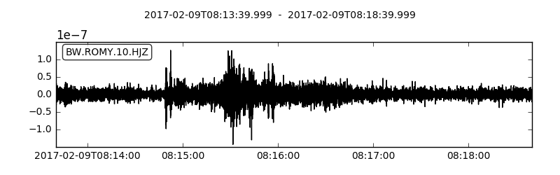
      </a>
    

  

 

 

#### <small>February 2017 </small> Romy in MUM

In the latest release of MUM, the journal of the Munich universities, there is a new article on the ROMY project. You can find the article [here](../docs/RomyMumFeb2017.pdf) (in German).

 

#### <small>January 2017 </small> Free-riding at the Nagra - 3D seismic in Switzerland

From October 2016 to February 2017 the [Nagra](http://www.nagra.ch), the Swiss company for finding a long-term solution for radioactive waste, performed a [large-scale 3D seismic campaign](http://www.nagra.ch/en/news/mediareleasedetail/large-scale-3d-seismic-campaign-complete.htm). Together with colleagues from ETH Zurich, we used this chance for our own measurements. Four prototypes of the portable rotation sensors from the company [iXblue](www.ixblue.com) were buried in the ground close to Eligsau for about three weeks  to record the vibration sources of the Nagra experiment. 

 

  

    

      
    

    

      
    

    

      
    

  

 

 

#### <small>December 2016 </small> Book launch "Computational Seismology"

Finally, the practical introduction on computational seismology, written by Heiner Igel, is [now available](https://global.oup.com/academic/product/computational-seismology-9780198717416?cc=de&lang=en&). This book is an introductory text to a range of numerical methods used today to simulate time-dependent processes in Earth science, physics, engineering, and many other fields. It also includes simulation methods used in the ROMY project. The theoretical concepts presented in the book are complemented by interactive Jupyter Notebooks at the [seismo-live webpage](seismo-live.org).

 

#### <small>November 2016</small> First weak rotational motion measurement of structural health monitoring on a spectacular building

End of November a group from LMU Munich was joining a campaign led by scientists of the [Dipartimento di Scienze della Terra](http://www.dst.unifi.it/), Univercity of Florence, led by Maurizio Ripepe, to measure the eigenvibrations of Gampanile di Giotto, the bells tower of the famous dome of Florence. Using two rotational motion sensors and 9 broadband seismometers the joint group will try to validate resent simulations and measurements performed by civil engineers and the Florence group, respectively.

 

  

    

      
    

    

      
    

  

 

 

#### <small>26/30th October 2016</small> Data from central Italy

The earthquakes in central Italy on 26th and 30th of October provided us an opportunity for a first check on our new, rotational instruments. The events have been recorded on the vertical component of our ringlaser and on the 3-component portable BlueSeis prototype. Here are first impressions:

*Right picture:*
Recording of the M6.6 Norcia event. Top is the vertical component of the ringlaser. The remaining traces are the three component of the BlueSeis prototype (1-N, 2-E, 3-Z). Data are lowpass filtered at 2Hz.

*Left picture:*
Same event. Cross-correlation of the ringlaser data (vertical component of rotation) with the transversal component of acceleration of station GR.FUR. Top subplot shows the bandpass filtered waveforms. The middle subplot shows the CC coefficients for varying backazimuths. The highest coefficients indicate the backazimuth of the event. Bottom subplot shows the phase velocities accociated with CC coefficients higher than 0.75.  Details of processing and theory can be found in e.g. [Hadziioannou et al., 2012](https://www.geophysik.uni-muenchen.de/~hadzii/files/hadzii2012_JoS.pdf).

 

 
 

  

#### <small>24th October 2016</small> Romy hears the ocean! 

Below is a figure comparing the secondary microseism band observed by ringlaser ROMY in Fürstenfeldbruck to the same timespan observed with the G-ring laser in Wettzell, at a distance of 160 km to the North-East. As shown in [Hadziioannou et al., (2012)](https://www.geophysik.uni-muenchen.de/~hadzii/files/hadzii2012_JoS.pdf), the G-Ring at Wettzell has sufficient sensitivity to pick up the ocean-generated noise in the secondary microseism (around 0.1-0.2Hz). Here, we are looking at an hour of 'quiet' signal, where no earthquakes can be seen. This figure shows that the first ring of ROMY very likely picks up the same oceanic noise sources as the ring in Wettzell. 

The left column shows the situation measured at the observatory in Fürstenfeldbruck. For reference, on the right the same time window is shown as measured at the Wettzell observatory. 

The top row shows the waveforms, bandpass filtered between 0.1-0.2Hz. 
In red is the vertical rotation rate measured by the ringlasers (ROMY, G-Ring), in black the transverse acceleration measured by broadband seismometers nearby (GR.FUR, GR.WET). 

In the bottom two rows, the colorscale indicates correlation coefficient between the rotation rate and transverse acceleration, for each 60 second timewindow (red=1, gray=-1). 
The center row depicts the the maximum values of the zero-lag correlation coefficient for each timewindow. For both observatories, we see pretty good correlation values, a strong indication that both instruments at each location (seismometer and ring laser) are picking up the same physical signal. 

The lowermost row shows a 'sweep' through all possible backazimuths, done for each timewindow. Red colors indicate backazimuths where the match between rotation and transverse waveform is good. The black dots mark the best correlation for each timewindow. Since the backazimuth is defined as clockwise from North, the strongest source we pick up here (between 250--300 degrees)  seems to be in the direction of the North Atlantic. This is consistent for both observatory locations. 

Processing is similar to that in Hadziioannou et al. (2012) and to the processing used for the [Rotational Event Database](http://www.rotational-seismology.org/data/eventdb). 
 

  

 
  
#### <small>September/October 2016</small> Field work on Stromboli with portable rotation sensors

From September 23 to October 14 a small expedition is working on Stromboli volcano. This is the first field work with some prototypes of a portable sensor for rotational ground motion ([BlueSeis-3A](www.blueseis.com)) from the company [iXblue](www.ixblue.com). In addition, standard broadband seismometers and tiltmeters are installed. Therefore, we have a collocated observation of direct and array-derived measurements for translation, rotation, and strain.

 

  

    

      <a class="thumbnail" href="#">
         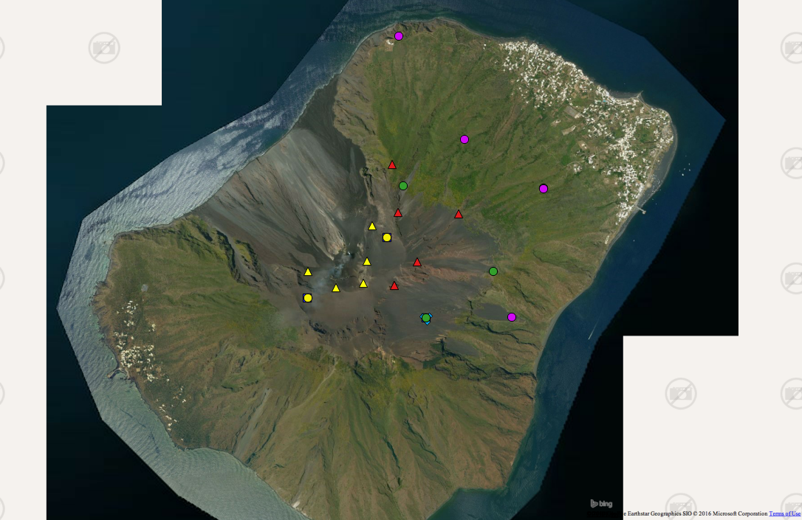
      </a>
    

    

      <a class="thumbnail" href="#">
         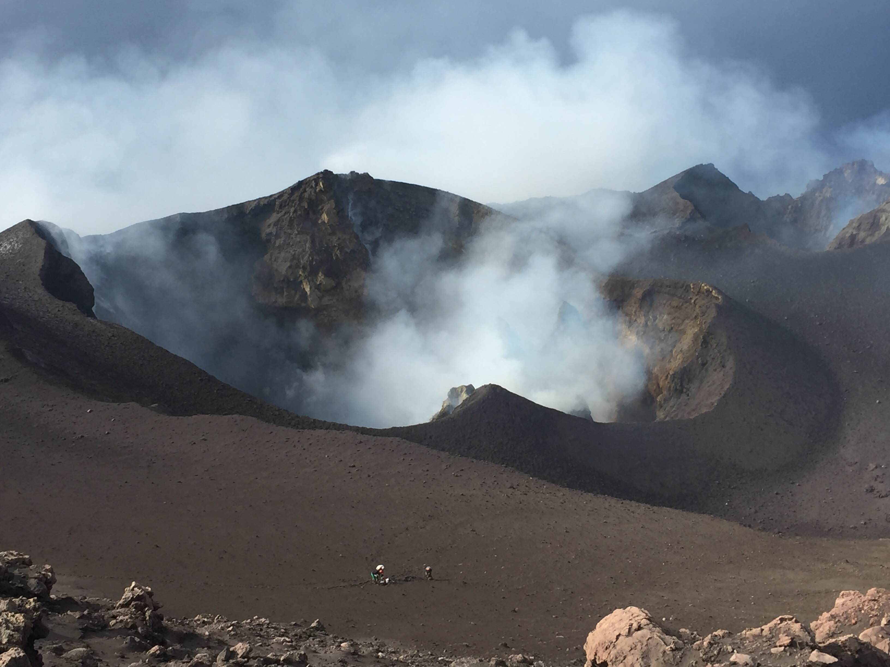
      </a>
    

  

 

 
Click on the following image to see a short movie from the field.

[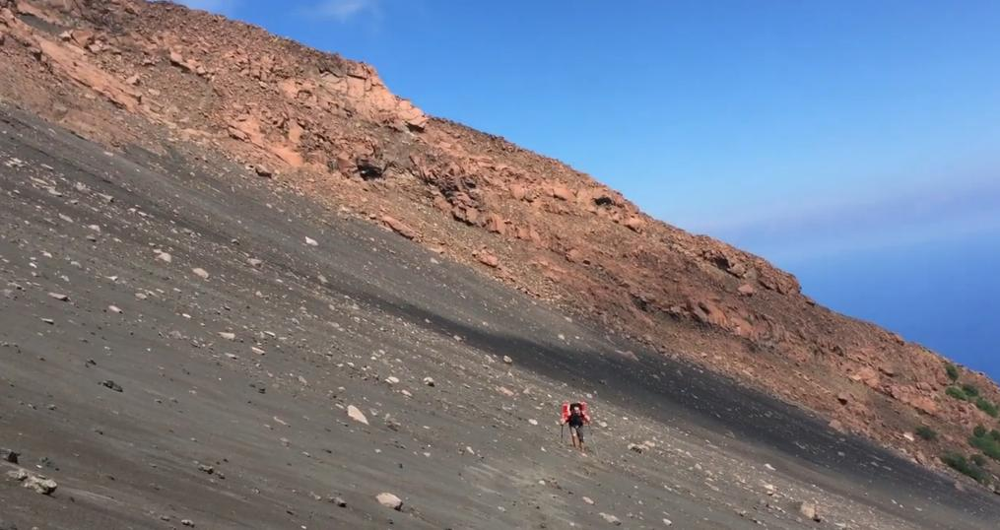](https://splice.gopro.com/v?id=epqGQdWJd)

 
 

#### <small>September 2016</small> Receiving the first prototype from iXblue

The first [BlueSeis-3A](www.blueseis.com) prototype of a portable, 3-component rotational sensor was shipped by the company [iXblue](www.ixblue.com), our cooperation partner. It will be tested during field work on Stromboli.

 

#### <small>2016/09/26</small> First light!

The horizontal ringlaser is now switched on. Since the ringlaser works with Helium-Neon gas, the resulting wavelength is 633 nm, which appears as red light.

  

    

      <a class="thumbnail" href="#">
         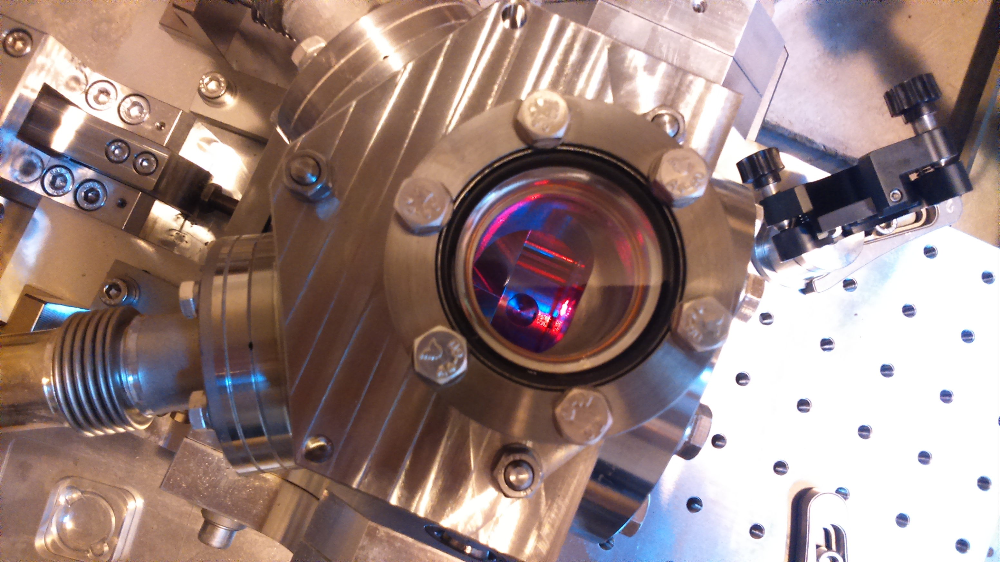
      </a>
    

  

 

#### <small>2016/09/09</small> Outer array finalized

Apart from the ringlaser and the three borehole stations on the observatory ground, we have installed five additional stations. They surround the observatory at a distance of about 2 km. Their installation began in August 2015 and is now finalized. Together with the data from the borehole stations, their data will be used to calculate array-derived rotation in order to compare it with the direct observations of the ringlaser.

The blue triangle marks the observatory, the stars show the positions of the outer stations.

  

    

      <a class="thumbnail" href="#">
         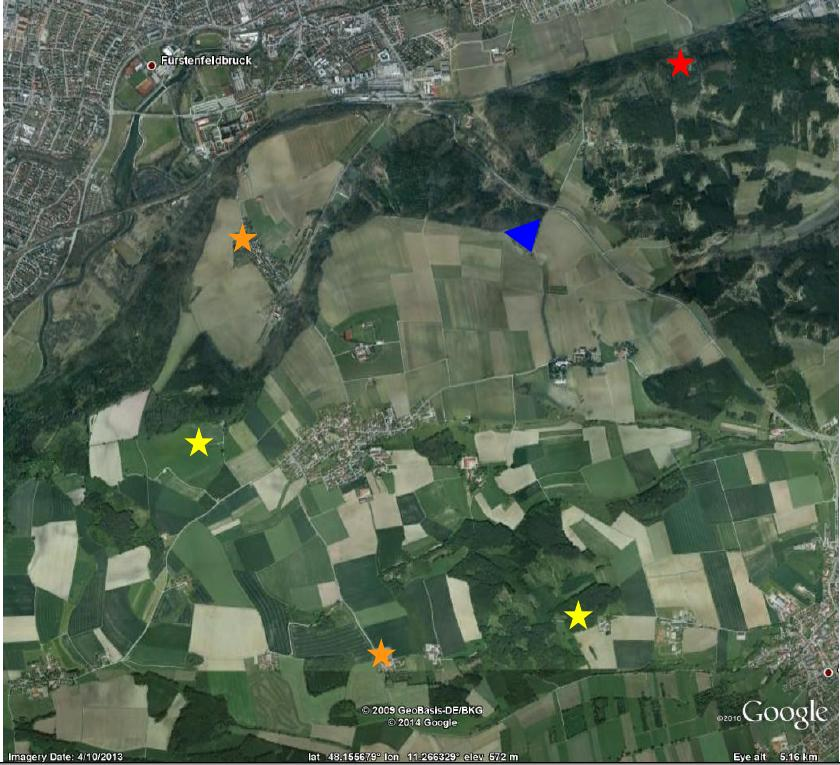
      </a>
    

  

 

#### <small>2016/08/25</small> Construction of ringlaser finished

Finally, after five exciting months, the construction of the ringlaser building is finished. From now on, the second and even more exciting step follows: we can start installing the optical devices.

  

    

      
    

  

 

<video id="pelican-installation" class="video-js vjs-default-skin" controls preload="auto" width="683" height="384" data-setup="{}">
<source src="../images/large_files/romy_canon_faster_stabilised_logo.mp4" type='video/mp4'>
</video>   

  

#### <small>May/June 2016</small> Dr. Nori Nakata visits LMU as a CAS Fellow

[Nori Nakata](http://stanford.edu/~nnakata/) currently holds a George Thompson Postdoctoral Fellowship at Stanford University (USA), where he works on a broad range of topics including many from the field of ambient noise and interferometry. His interests extend to both the theoretical and methodological aspects of rotational seismology.

During his visit, Nori will work on developing new applications for the data which will be recorded in the future with the new ringlaser, as
well as test them with archive data available from the Wettzell sensor.
  

#### <small>May 2016</small> ROMY in the media

The Bayrische Rundfunk - a regional radio and television channel - got interested in the ROMY project and broadcasted reports in radio and TV, interviewing Heiner Igel and Joachim Wassermann. Here, you can listen/view them (in German): [radio-1](http://www.br.de/nachrichten/oberbayern/inhalt/romy-erdbebenzentrum-ffb-100.html), [radio-2](http://www.br.de/radio/bayern1/sendungen/mittags-in-oberbayern/einzigartiges-forschungsinstrument-erdbeben-ffb-100.html), [radio-3](http://www.br.de/radio/bayern2/programmkalender/ausstrahlung-687924.html), and [radio-4](http://www.br.de/radio/bayern2/wissen/iq-wissenschaft-und-forschung/erdbebenmessung-bei-muenchen-100.html).

 

<video id="pelican-installation" class="video-js vjs-default-skin" controls preload="auto" width="683" height="384" data-setup="{}">
<source src="../images/erdbeben-abendschau.mp4" type='video/mp4'>
</video>   

  

#### <small>April 2016</small> News from EGU, Vienna

At the EGU General Assembly in Vienna Prof. Ullrich Schreiber (ring laser specialist in ROMY project) receives Christiaan Huygens Medal. congratulations!

Also, plans for a new broadband rotation sensor by iXBlue (St. Germain-en-Laye near Paris) launched during the instrumentation session. During the session the official www page of the new rotation sensor called BlueSeis-3A was launched. The first prototype shall be shipped to LMU in September 2016.   

 

  

    

      <a class="thumbnail" href="#">
         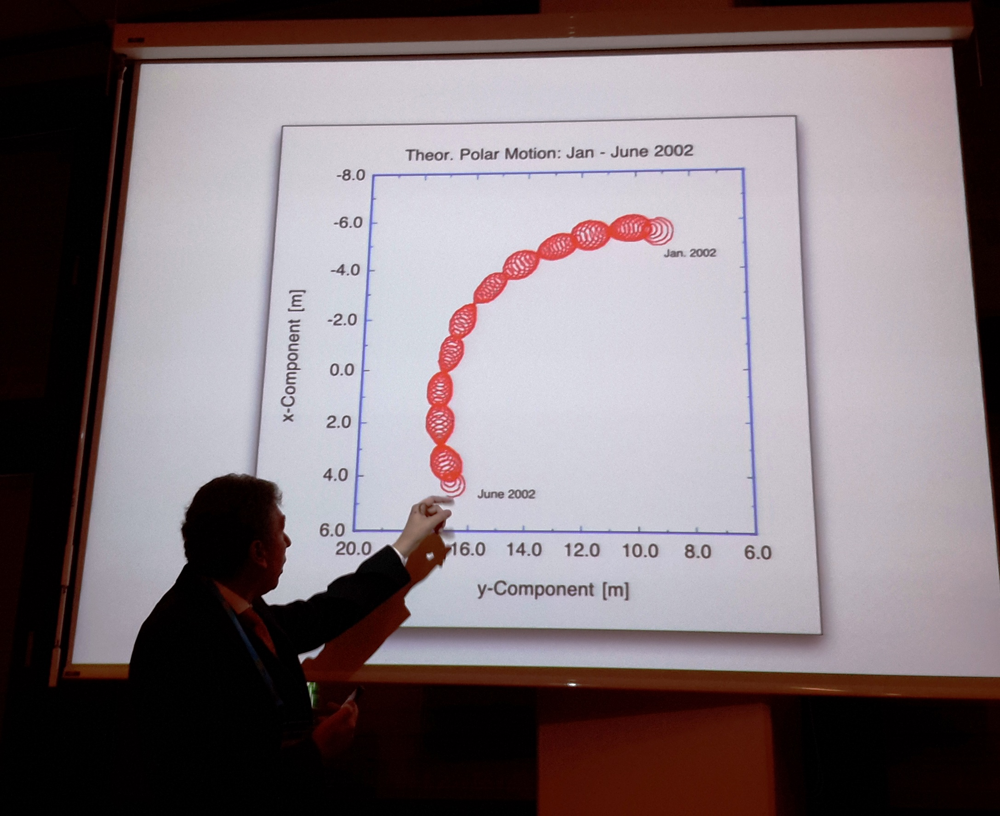
      </a>
    

    

      <a class="thumbnail" href="#">
         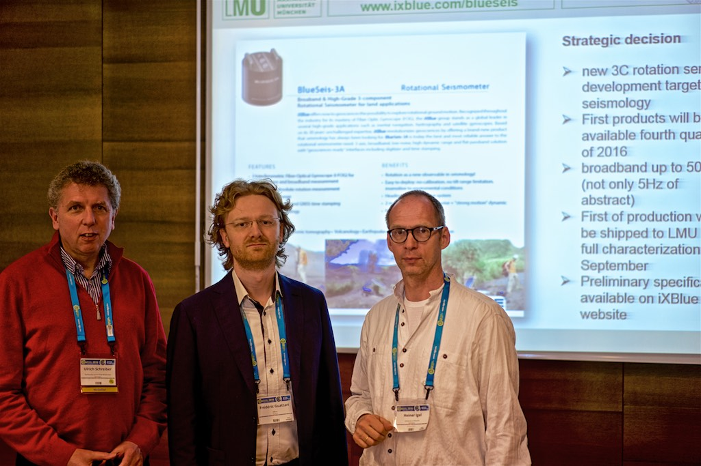
      </a>
    

  

 

#### <small>April 2016</small> Touch down

The deepest point of the ringlaser construction is touched - the hole is finished. After finalising the base, the construction of the tetrahedral structures will start from bottom to top. 

 

  

    

      
    

    

      <a class="thumbnail" href="#">
         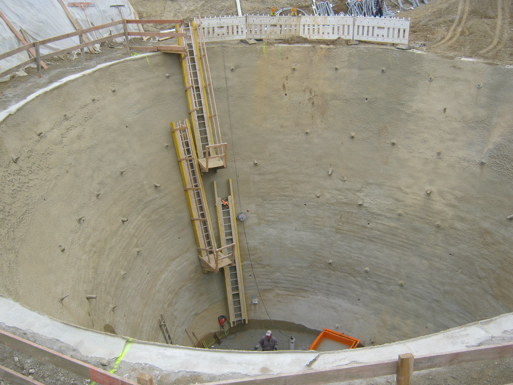
      </a>
    

    

      <a class="thumbnail" href="#">
         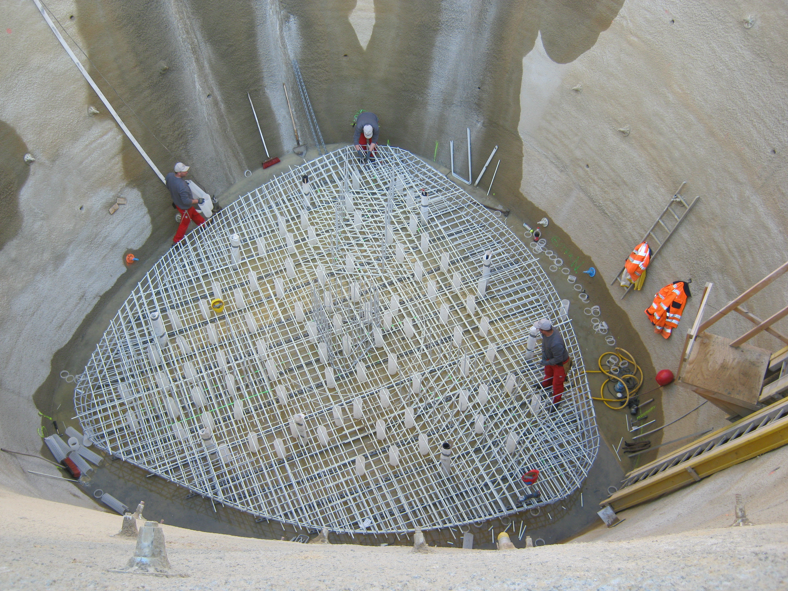
      </a>
    

  

 

#### <small>March 2016</small> Medial attention

On March 31st the local newspaper of Fuerstenfeldbruck *Merkur* became interested in our project and construction activities. The full article you can find [here](http://www.merkur.de/lokales/fuerstenfeldbruck/fuerstenfeldbruck/krater-erdbebenforscher-6265455.html) (in German). 
  

#### <small>February 2016</small> Beginn of construction for the ringlaser

Finally, the construction has started! At the end of February the construction company started to dig the 33 by 15 meter hole (diameter x depth) for the first-of-its-kind 3-component tetrahedral ringlaser. We expect the end of the construction and installation within this summer. With this new instrument it will be possible to observe the complete 3D field of rotational ground motions for the first time.

  

    

      
    

  

#### <small>August 2015</small> Installation of borehole stations completed

At all three boreholes the installation of stations is completed. The stations are equipped with Nanometrics Trillium 120 Posthole instruments and Centaur recorders. They are named FFB1 (90m, S corner of observatory), FFB2 (15m, NE corner), and FFB3 (15m, NW corner). Data can be retrieved via fdsn webservices.
   

#### <small>2015/04/12-17</small> ROMY at EGU

At the annual [General Assembly of the European Geosciences Union](http://www.egu2015.eu) in Vienna Toshiro Tanimoto et al. presented their work about ["Estimates of Rayleigh-to-Love wave ratio in microseisms by co-located Ring Laser and STS-2"](http://meetingorganizer.copernicus.org/EGU2015/EGU2015-4155.pdf)
   

#### <small>2014/11/18</small> Begin of drilling for borehole stations

For the three borehole stations surrounding the ringlaser the drilling of the boreholes has began. The borehole next to the location of the ringlaser with a depth of 90m is the first one to be drilled. The other two boreholes with depths of 15m will be drilled within the next days and weeks.
  

  

    

      <a class="thumbnail" href="#">
         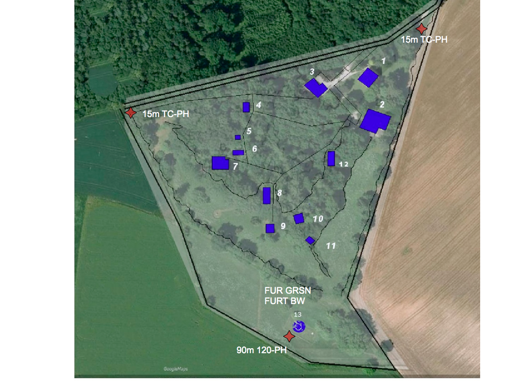
      </a>
    

    

      <a class="thumbnail" href="#">
         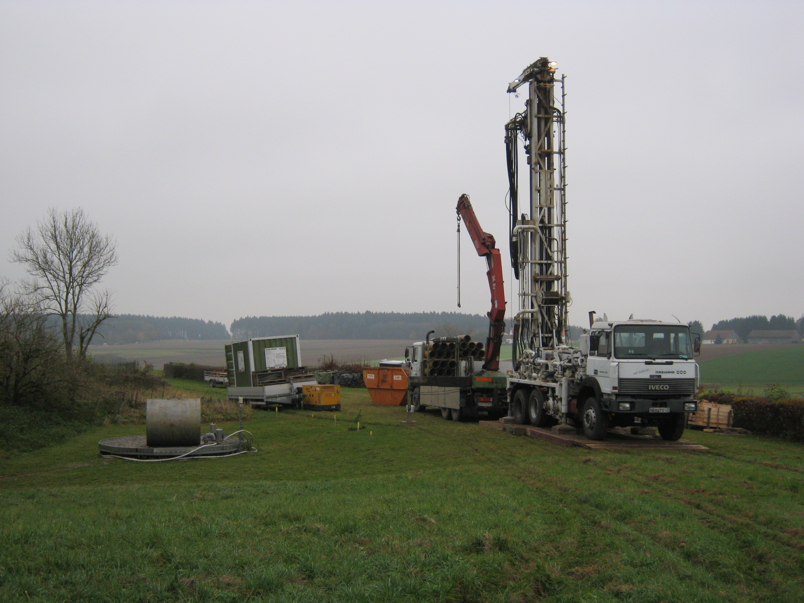
      </a>
    

    

      <a class="thumbnail" href="#">
         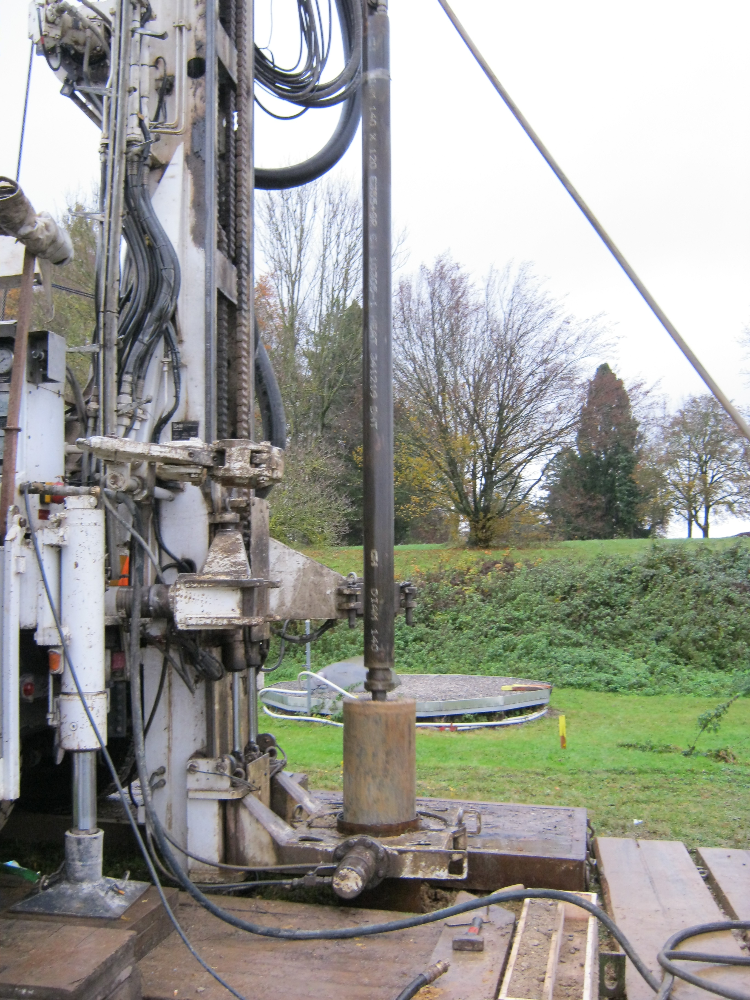
      </a>
    

  

#### <small>Oct. 2014</small> Additional funding by LMU

The LMU has decided to co-finance the installation of the ring laser in the Geophysical Observatory Fürstenfeldbruck allowing us to realize our favoured geometry with a tetrahedral shape and 12m side length. Start of construction is planned for spring 2016.

  

#### <small>2014/07/04</small> Prof. Toshiro Tanimoto visits LMU as CAS Fellow 

Prof. Tanimoto is one of the leading experts on the topic of the Earths
Hum. In September/November 2014 he will visit our group as a CAS
visiting fellow. Together, we will work on questions concerning the Hum
based on ring laser observations. In the context of his visit we will
organize a workshop centered around the Earth Hum (further
information can be found [here](WShum.html)). 

  
#### <small>2014/05/30</small> Successful completion of OBS experiment with a rotation sensor

For the first time a rotation sensor was attached to an ocean bottom instrument and lowered to the shallow sea floor in the North Sea near German island of Helgoland. In cooperation with the Alfred-Wegener Institution (AWI) in Bermerhaven we investigate options to determine the orientation of the sensors at the sea floor and the characteristics of noise on the seafloor. The data are now being analyzed. 
 
  
#### <small>2013/08/13</small> [ERC Advanced Grant (LMU Press Release)](https://www.en.uni-muenchen.de/news/newsarchiv/2013/f-m-58-13.html)

LMU geophysicist Professor Heiner Igel has been awarded an Advanced Grant worth 2.5 million euros by the European Research Council (ERC). Igel will use the grant to develop a novel type of rotation sensor for the analysis of seismic waves. ERC Advanced Grants honor European researchers who have already made their mark in their respective fields, and are intended to enable them to undertake innovative and high-risk projects. [(full article)](https://www.en.uni-muenchen.de/news/newsarchiv/2013/f-m-58-13.html)
