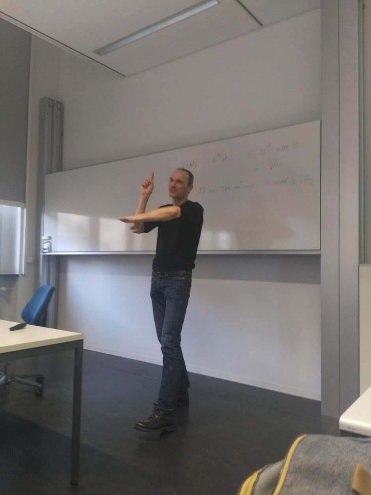
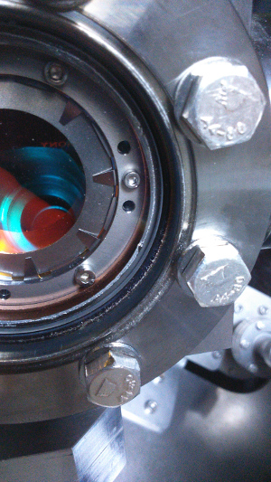

title: News
Slug: news
Authors: Heiner Igel

### <small>October 2021</small> Further experiments at the BAM Test bridge "BLEIB"

An exciting active and passive experiment is currently happening over three weeks at the concrete test bridge 
at the test facility of the "Bundesanstalt für Materialprüfung" (BAM) 30km south of Berlin (see also below). 
This time the bridge is undergoing various pre-stress levels and we attempt to detect the associated 
velocity changes with standard seismometers, rotation sensors, DAS cables, and ultrasonic sensors. 

 

    

      
    

### <small>September 2021</small> Seismic Array around ROMY reinstalled 

Five seismic stations form an outer array and surround ROMY, located at the site of the 
geophysical observatory in Fürstenfeldbruck, in an approximately 5 km radius. This array is 
used to compute array derived rotations as a comparison to the direct, high sensitivity rotational
 motion observations of the ring laser. This seismic array was first setup in 2015 and operated successfully 
 until 2021. Now, the previous mix of sensors has been exchanged by a set of five STS2 sensors, kindly provided 
 by the Institute of Earth Sciences, Academia Sinica in Taiwan. This extends the operation of the array up to 2025. 
 Some of the sensors are buried, others located in old barns or water reservoirs. Each STS2 is positioned 
 on top of a 4 cm thick gabbro plate and shielded against ambient temperature and pressure variations.  
 
 

    

      
    

### <small>June 2021</small> Andreas Brotzer wins PAROS fellowship of the American Geophysical Union 

Andreas Brotzer, PhD student working on the ROMY ring laser has obtained a 5000$ scholarshop 
from the American Geophysical Union! Congratulations!

The Paros Scholarships in Geophysical Instrumentation were established through 
the generosity of Jerome M. Paros to support graduate students with a demonstrated 
interest in geophysical instrumentation and precise field measurements in seismology, 
atmospheric sciences, or ocean sciences. This $5000 scholarship is awarded to three 
students each year to help build a solid pool of talent working on and interested 
in geophysical instrumentation.

Andreas will spend the money visiting SCRIPPS to develop concepts using strain measurements 
to stabilize the ROMY observations for geodetical (and seismological) observations.  

### <small>June 2021</small> Special Issue in "Sensors" 

19 papers are now published in the special issue "Rotation Rate Sensors and Their Applications" that was initiated 
at the last meeting of the International Working Group on Rotational Seismology in Taiwan in 2019.

The papers also featuring ROMY and blueSeis3A data are accessible here:
[Special Issue](https://www.mdpi.com/journal/sensors/special_issues/Rotatin_Rate_Sensors)

### <small>January 2021</small> Paper on ROMY in Geophysical Journal International

The paper "ROMY: a multicomponent ring laser for geodesy and geophysics" is now published. 
It focuses on the design process and first seismological observations. 
The paper is accessible [here](https://academic.oup.com/gji/article/225/1/684/6064309)

### <small>February 2021</small> Five broadband sensors from Taiwan arrive 

Through our former researcher Chin-Jen Lin we could arrange five STS2 broadband stations that we obtain on loan from Academia 
Sinica in a joint project. The seismometers support our seismic array around the ROMY ring laser helping to cross-validate our 
observations. 

### <small>October 2020</small> Experiment with blueSeis3A on a model bridge

A first unique experiment was carried out on a model bridge at the BAM testing facilities. Watch youtube movie!
<iframe width="560" height="315" src="https://www.youtube.com/embed/szYqnmuEoNw" title="YouTube video player" frameborder="0" allow="accelerometer; autoplay; clipboard-write; encrypted-media; gyroscope; picture-in-picture" allowfullscreen></iframe>

### <small>July  2020</small> "Editor's Highlight" in PRL: PAper on ROMY

The paper "Reconstruction of the Instantaneous Earth Rotation Vector with Sub-Arcsecond Resolution 
Using a Large Scale Ring Laser Array" was features in Editor's Highlight and featured in many pupular science 
news article! The paper focuses on the impact of ROMY on measuring Earth's rotation. 
The paper is accessible [here](https://journals.aps.org/prl/abstract/10.1103/PhysRevLett.125.033605)

### <small>May  2020</small> Andreas Brotzer joins the ROMY project!

Andreas Brotzer, MSc from KIT, joins the ROMY project as a PhD student. He will work on any aspect of 
ROMY data processing, hardware adaptation, data analysis and interpretation of ring lasers.  

### <small>March  2020</small>  Bavarian television (BR) shoots in Fürstenfeldbruck and Wettzell

The science editors of the Bavarian Television decided to shoot a short movie on the ROMY project. The programm will be transmitted Saturday March 28 at 19:00 (Gut zu wissen). 

    

      
    

    

      
    

    

      
    

### <small>March 1 2020</small> ROMY ERC-Advanced project officially ends

The ROMY project ends after 5+1 (one year extension) years! On the same day one further ROMY-followup project starts! The GIOTTO project, funded by the German 
Ministry of Research in  a call dedicated  to early warning, will focus on 6C observations using fibre-optic technology in structural engineering. The goal is to 
develop a novel structural health monitoring concept using 6C observations. 

### <small>January 2020</small> Special Issue on Rotational Seismology in "Sensors"

Following the 6th IWGoRS Meeting in Taiwan a special issue on rotational seismology (the 3rd one) will be published in the journal "Sensors". The deadline for 
submissions is 31st July 2020. More info on: [IWGoRS](http://www.rotational-seismology.org)

### <small>January  2020</small> iXblue Users Meeting in the Landing 42 Venue in London

iXblue - the company that produces the rotation sensor blueSeis-3A organized a users meeting for their products at the spectactular Landing 42 Venue in 
the downtown London Area. Heiner Igel presented laboratory and field data and applications with the blueSeis-3A sensor. 

    

      
    

    

      
    

 
### <small>December  2019</small> Special Session at the 100th AGU Fall Meeting in San Francisco 

An exciting session was co-organized by ROMY scientists around the topic of strain and rotation measurements. The 100th AGU Meeting at a substantial
fringe programme celebrating its achievements. iXblue once more had a sizeable stand in the exhbition area promoting blueSeis-3A and its other products. 

    

      
    

    

      
    

    

      
    

### <small>November  2019</small> Experiments successful!

The seismic experiment with an unprecedent number of rotation sensor components (>40) was successful! After a few days of installation of buried DAS cables, geophones, 
broadband sensors, and a variety of rotation sensors (blueSeis-3A, rotaphone, fibre-optic gyros from Polish scientists and Steckeisen, mems-based sensors) so-called huddle tests were carried 
out to  investigate the instrumental noise. This was followed by dozens of vibrator truck measurements as well as several small explosions in shallow boreholes. 
A tremendous amount of data was collected and is now being analyzed. First results are expected to be reported at the EGU2020 Meeting in Vienna.

    

      
    

    

      
    

    

      
    

    

      
    

### <small>November  2019</small> Tension mounting in preparation for seismic experiment

Felix Bernauer is organizing a world-wide unique experiment to be staged at our Observatory in Fürstenfeldbruck. 
For the first time we will have dozens of portable rotation sensors, geophones, broadband seismometers and a DAS cable measuring strain. 
We will use a truck vibrator source and small explosions to generate waves. The goal is to understand the benefit of additional gradient based measurements 
(rotation, strain) for near surface exploration. 

    

      
    

### <small>October/November  2019</small> Work on ring laser continues

While the ring laser is lasing in a very stable way (which means the optical path is established), the Sagnac frequency is sometimes lost indicating problems 
with beam power and mode hops. In preparation for the November seismic experiment we work on stabilizing the Sagnac frequency. 

    

      
    

    

      
    

    

      
    

    

      
    

### <small>October  2019</small> Toshiro Tanimoto (UC Santa Barbara) visits LMU for three weeks

Toshiro Tanimoto visits LMU to collaborate on ring laser observations in particular looking at ocean generated noise. 

    

      
    

    

      
    

### <small>September  2019</small> 5th IWGoRS Meeting at Sun Moon Lake, Taiwan, 22-26 September, 2019

Some 60 scientists from around the world met for the 5th meeting of the International Working Group on Rotational Seismology at beautiful Sun Moon Lage in Taiwan. 
The rich program with new results in ring laser observations, portable rotation sensors, earthquake engineering, volcano and earthquake seismology was complemented by a 
very interesting excursion to the fault traces of the 1999 Chi-Chi earthquake. More info on: [IWGoRS](http://www.rotational-seismology.org)

    

      
    

    

      
    

    

      
    

### <small>September  2019</small> Erhard Wielandt visits the Observatory

One of the founding fathers of modern broadband seismology Prof. Dr. Erhardt Wielandt visited the Observatory to consult on seismometer calibration. He also visited the ROMY ring laser. 

    

      
    

### <small>September  2019</small> Workshop and Volcano Excursion, Kamchatka

Joachim Wassermann and Heiner Igel were invited to attend a workshop on "Geodynamics, earthquakes, and volcanism in subduction zones" held in Petropavolovsk, Kamchatka, 
Russia organized by Nikolai Shapiro (Univ. Grenoble). We reported on progress with ObsPy as well as the application of rotational seismology on volcanoes. 
Following the workshop we drove 600km north to visit the active volcanic area. We were very successful with the weather and had spectacular views!

    

      
    

    

      
    

### <small>August  2019</small> blueSeis huddle test in the Observatory Fürstenfeldbruck

German users of the blueSeis-3A sensor met at the observatory to perform a huddle test with the rotation sensors. 
In such a test sensors are collocated and the data compared to investigate the level of coherence. 

    

      
    

#### <small>July  2019</small> First installation of blueSeis-3A sensor in Greenland

Joachim Wassermann spent 4 weeks in Greenland in a joint experiment with the group of Prof. Fabian Walter (glaciology, ETH Zurich). 
The goal was to record motion of a fast moving glacier and to investigate whether the measurement of rotational motions can help 
solving science questions around the movement and characteristics of glaciers. 

    

      
    

    

      
    

### <small>July  2019</small> PIONEERS project meeting in Paris

A 2-day plenary project meeting was held in Paris July 1-2. The meeting focused in particular on the technical requirements for planetary science cases using 6C sensors. 

    

      
    

#### <small>June 2019</small> GIOTTO project funded by the German Ministry of Research! 

A joint proposal with the Univ of Hamburg and the Bundesanstalt für Materialprüfung (BAM) in Berlin was successful! The project is called GIOTTO and 
aims at adapting the 6C sensor strategy for earthquake engineering. It will involve instrumenting test structures, new and historic buildings with 
6C sensors and develop a new structural health  monitoring strategy. 

### <small>April  2019</small> EGU 2020 in Vienna: Special Session, iXblue Reception, ROMY dinner

Again we organized a well-attended special session on new instrumentation. iXblue organized a reception at the top of Vienna tower, that was rounded off by a joint ROMY dinner. 

    

      
    

    

      
    

    

      
    

#### <small>March and June 2019</small> Visiting professor at IPG Paris

Heiner Igel spent twice two weeks at the Institut du Physique du Globe in Paris to with Jean-Paul Montagner on the theory of rotational ground motions in anisotropic media. 

### <small>April  2019</small> Y. Gao visits Munich for 6 months

Y. Gao from  Institute of Geology and Geophysics, Chinese Academy of Sciences (IGGCAS) visits us and will work on simulating 6C motions in buildings using the salvus software. 

#### <small>March  2019</small> PIONEERS Kick-off meeting in Toulouse

The PIONEERS project was kicked off with a 2-day meeting in Toulouse March 7-8. 
Options were discussed to have the new instruments to be developped beinbg part of already planned planetary missions (e.g., the MMX mission to Phobos to be launched in 2024). 

    

      
    

    

      
    

### <small>February  2019</small> blueSeis Meeting at ETH Zurich

Thanks to Dr. Cedric Schmelzbach a Meeting was held at ETH on February 5 discussing the state of the art of fibre-optic technology applied 
to rotational ground motion observations and science cases. 

    

      
    

    

      
    

    

      
    

#### <small>January 2019</small> EU Project PIONEERS starts

The H2020 funded project PIONEERS (Planetary Instruments based on Optical technologies for an iNnovative European Exploration using Rotational Seismology) starts. 
The aim is to build on the collaboration with iXblue to adapt the blueSeis-3A technology for applications in planetary geophysics. 

#### <small>November  2018</small> Meeting with iXBlue at the Geophysical Observatory Fürstenfeldbruck

Frederic Guattari and his team from the  [iXblue company](http://www.ixblue.com), France, visited us November 28. 
We discussed the status of the [blueSeis](http://www.ixblue.com)
family of sensors, recent laboratory and field observations and future cooperation. 

    

      
    

    

      
    

#### <small>November  2018</small> Mirror change of one of the ring lasers

Under the guidance of Dr. Andre Gebauer a number of operations have been carried out at the ring laser. 
These include gas changes and the change of a mirror in the one ring laser that suffered from a leak. 

    

      
    

    

      
    

####<small>November 2018</small> Invited talks at Meetings on the Future of Seismic Instrumentation

Joachim Wassermann and Heiner Igel gave invited talks on the use of portable rotation sensors in seismology 
in Potsdam (Workshop European seismology at the frontier: new capabilities and techniques, November 21-23)and 
Edinburgh (Future of passive seismic acquisition, November 12-13), respectively.   

#### <small>October  2018</small> Visit to Taiwan: Invited talks, Measurements in Taipei 101, Exploring Venue for IGWoRS Meeting 2019
Data
Joachim Wassermann and Heiner Igel visited Academia Sinica in Taipei, Taiwan, early October. Two invited talks covered ROMY related 
research on ring laser developments and observations and new portable sensor blueSeis. One blueSeis sensor was recovered from 
the Taipei 101 tower with a height of over 500m one of the tallest buildings on Earth. Data were collected to explore opportunities for 
blueSeis in earthquake engineering. 

    

      
    

    

      
    

Furthermore we explored several options and chose the specific venue for the 5th Meeting of the working group on rotational 
seismology that will be held at Sun Moon Lake in Taiwan in September 2019. 

    

      
    

    

      
    

#### <small>September 2018</small> ROMY Follow-UP project funded by the German Research Foundation starts!

Andre Gebauer, previous postdoc of the ROMY project has successfully obtained a DFG project entitled "Omega-E: 
Establishing the instantaneous Earth rotation vector by inertial rotation sensing" with the aim 
to develop a scheme to stabilize the ring laser geometry. 

#### <small>September  2018</small> Field observations with blueSeis at Stromboli volcano

Joachim Wassermann, Felix Bernauer, Thomas Braun and other performed new field observations at Stromboli volcano, 
one of the most active volcanoes in Europe. The team was accompanied by photographer/journalist Robert Gongoll. 

    

      
    

####<small>September 2018</small> Invited talk at the Institut de Physique du Globe on Paris

... reporting recent progress in the field or rotational seismology ... 
  

#### <small>July 2018</small> Andrea Simonelli defends his PhD in Pisa, visit to future OBS site in Cinque Terre

Andrea Simonelli obtained a joint PhD degree from the universities of Pisa and LMU on rotational seismology entitled "Earthquake-induced
rotational ground motion observed by optical rotational sensors". Half of his PhD was financed by the ROMY project. 
He worked on the first earthquake-induced wavefield observations with the blueSeis sensor.  

    

      
    

    

      
    

Following the dissertation, we visited the site of the new ocean-bottom test facility near Corniglia, Cinque Terre. 
The 6 DoF OBS test system that is developed with Prof. Hadziioannou (Univ. of Hamburg) is scheduled to be installed early 2019.

    

      
    

####<small>July 2018</small> H2020 proposal to adapt blueSeis to planetary applications successful!

The H2020 proposal PIONEER (Planetary Instruments based on Optical technologies for an iNnovative European Exploration using Rotational Seismology) submitted in March to the European Union was successful! 
The project involves iXblue, ETH Zurich, IPG Paris and other universities and is coordinated by 
Raphael Garcia (Toulouse, France). The project will start January 2019. LMU is leading one of the work packages. 
  

####<small>July 2018</small> blueSeis sensor installed near the erupting Kilauea crater

The Big Island Hawaii saw a dramatic volcanic crisis during the summer of 2018. To demonstrate the 
potential of observing the complete ground motion in the near field of seismic/volcanic sources J. Wassermann 
- in cooperation with Brian Shiro - installed a blueSeis rotation sensor near the erupting crater returning spectacular data for 
almost daily M5 seismic events due to the collapse of the caldera.  

    

      
    

  

####<small>May 2018</small> Launch of the INSIGHT Mars Mission

On May 5th the INSIGHT mission to Mars was successfully launched from the Vandenberg Air Base in California. 
The mission will have components or rotational seismology in the sense that attempts will be made to 
use the 6 translational sensors to derive rotational motions. The lander touched down on November 26th. 
ROMY is involved with the INSIGHT Team in connection with the H2020 Pioneer project that aims at 
developing a 6 DoF sensor for planetary applications. (Photo courtesy and copyright Simon Stähler)

    

      
    

  

####<small>March 2018</small> The Munich Winter School “Skience” for the first time on 6C concepts

36 participants from all over the world (South Corea, Israel, Venezuela, Indonesia, etc.) participated in the [8th Winterschool in Sudelfeld](https://www.geophysik.uni-muenchen.de/MESS/2018), enjoying the exciting new concepts on 6C polarization analysis presented by the ETH group (Schmelzbach, Sollberger, Renterghem), homogenization and gradients (Univ Nantes, Capdeville), and theories to optimize experiments (Curtis, Univ. Edinburgh). This was complemented by Python/ObsPy Intro and array analysis (Wassermann), general aspects of rotational seismology (Igel), and portable rotation sensor technology (Bernauer). The participants also enjoy the skiing aspects of the “Skience” concept!

  

    

      
    

    

      
    

    

      
    

  

  

#### <small>March 2018</small> BlueSeis is going into space! New H2020 proposal submitted!

The ROMY scientists have promoted for some time that the 6C measurement concept is particularly interesting for planetary observations. LMU is involved in a new proposal called PIONEERS under the H2020 call “Scientific instrumentation and technologies enabling space science and exploration” aiming at the development of an optical technology based 6C sensor concept for space. The project shall be coordinated by Institut Superieur de l’Aeoronautique et de l‘ Espace in France and involves IPG Paris, ETH Zurich, and iXblue.
  

#### <small>February 2018</small> Invited lectures and short course in the US

Heiner Igel gave invited lectures at the University in Austin, Texas, and at the Colorado School of Mines in Golden, 
including a short course in the field of computational seismology. In Austin he had the 
opportunity to meet with Prof. Nakamura, the pioneer of lunar seismology. 
  

    

      
    

####<small>January 2018</small> EU-Training Network Proposal submitted

A proposal for an EU-funded training network called SPIN (Seismological Parameters and Instrumentation) was submitted in January. The project shall fill the gap in training of young Earth scientists in the field of modern instrumentation concepts including the observation of rotational motions as well as the emerging field of distributed acoustic sensing.  The project shall be coordinated by the Univ. of Hamburg and involves LMU Munich, ETH Zurich, iXblue, IPG Paris, GFZ Potsdam, the Univ. of Grenoble, and others. 
  

####<small>December 2018</small> BlueSeis reception and ROMY dinner at AGU

BlueSeis had its first appearance at an AGU Fall Meeting in 2018! iXBlue organized a reception that was well attended indicating the interest of the community for the new broadband rotation sensing technology. A dinner with ROMY collaborators was organized in the French Quarter during the AGU Fall Meeting.

  

    

      
    

    

       
    

  

  

#### <small> Dezember 2017 </small> Rotations @ AGU

This year again, we have a special session at AGU in New Orleans. Look for further details under [Events](events.html) and see the complete [list of ROMY contributions](../docs/AbstraktListe.pdf).

 

#### <small> October/November 2017 </small> BlueSeis in the Cathedral of Cologne

Together with scientists from the [Erdbebenstation Bensberg](http://www.seismo.uni-koeln.de/station/index.htm), University of Cologne, led by Klaus Hinzen, three portable rotational motion sensors, one of them BlueSeis3A, were installed in the cathedral of cologne, one of the UNESCO world cultural heritage sites. The sensors were installed together with 3C broadband seismometers on three different stories of the north tower. The aim of this experiment is to observe rotational eigenmodes and the absolute movement of the tower as well as to explore the advantage of 6C measurements for structural engineering applications.

 

#### <small> October 2017 </small> The ROMY bike shirt cruising around Sardinia

A road bike team wearing the ROMY shirt was cruising around Sardinia in October 2017. Interested in the bike shirt? Please contact heiner.igel@lmu.de

    

      
    

 

#### <small> mid September 2017 </small> Presenting the blueSeis concept in Beijing, China

Frederic Guattari and co-workers from iXBlue and Heiner Igel (LMU) visited Beijing, China, in the week of September 18, 2017 to present the blueSeis concept to the Chinese seismological community. blueSeis will be distributed and serviced through the local company. The concept was presented at the Chinese Earthquake Administration and the Chinese Academy of Geological Sciences. An experiment with the blueSeis sensor was carried out in an underground laboratory North of Beijing. Joint sessions on the topic of new instrumentation strategies are planned for the memorial meeting of the 2008 Wenchuan earthquake to be organized in 2018.

    

      
    

    

      
    

    

      
    

 

#### <small> mid September 2017 </small> Leak discovered in the ROMY cavity 

After observing that the vacuum deteriorated slowly in one of the four ROMY rings, first, all O-rings were replaced which did not lead to any improvement. Finally one has to resort to a leak detection system using Helium. A device is connected to the vacuum and measures the amount of Helium inside the cavity. Then, Helium is blown from outside in areas where the leak is likely to be (e.g. corners, connections). The sudden increase in Helium content inside the cavity is then an indication for a leak at the specific location. Luckily there was an obvious location at one of the corner windows. Since the Helium experiment in mid September the window was replaced and the leak is now fixed!

    

      
    

    

      
    

 

#### <small> August 2017 </small> Meeting on Quantum Optics with the group of Prof. Hänsch 28.8.-1.9.2017

Ulrich Schreiber and Heiner Igel were invited to participate in the group meeting of the Quantum Optics groups of LMU/MPI. They presented their work on the ROMY ring laser and associated applications in geophysics and geodesy. Cooperation is envisaged using very long fibre-optic cables running through Germany as double giant ring interferometers. The picture shows Nobel prize winner Prof. Hänsch flying a drone for the group photo.

    

      
    

 

#### <small> July 2017 </small> ROMY in the press

More and more ROMY gets attention in the press. Here are some articles (all German):  

[Fürstenfeldbrucker Tageblatt](../images/large_files/20170724094256969.pdf)  
[Kreisbote Fürstenfeldbruck](../images/large_files/20170728145308943_0001.jpg)  
[SZ 1](http://www.sueddeutsche.de/muenchen/forschungsprojekt-romy-fuehlt-der-erde-den-puls-1.3604647) und [SZ 2](http://www.sueddeutsche.de/muenchen/fuerstenfeldbruck/fuerstenfeldbruck-weltweit-einmaliger-ringlaser-soll-erdbeben-und-vulkanausbrueche-vorhersagen-1.3602434)

 

#### <small> July 2017 </small> New bike shirt

Because the most members of the working group are enthusiastic bikers, a new bike shirt is created for each project. Here is the ROMY bike shirt with translational and rotational seismograms of the M8.3 Hokkaido earthquake of 2003. The sleeves are covered with equations from rotational seismology. Get your shirt [here](https://docs.google.com/forms/d/e/1FAIpQLSedMhB7B1S3CzsVXtwT1Iayu2sJzhUoGILIrEo_dF7zcKzOXg/viewform).

 

#### <small> 21 July 2017 </small> Offiziell inauguration of ROMY

Finally, in a pleasant celebration at Kloster Fürstenfeldbruck the ringlaser ROMY got officially inaugurated. The [program](../images/news/ROMY-21-7-2017.pdf) started with greetings and continued with interesting talks on the development of ROMY and its applications. About 100 guests enjoyed the event. In the afternoon the guests could visit the observatory.

 

 

  

    

      
    

    

      
    

    

      
    

  

   

    

      
    

    

      
    

    

      
    

  

 
 
 
 
 

#### <small> July 2017 </small> First 3C measurement

For the first time, three out of four rings are running in parallel. The left figure shows the screen of the digital osciloscope. The Sagnac signal coming from the photomultiplier is nicely visible. The middle figure is a 2C recording of the M6.7 Greece event from 20.07.2017 and the right figure shows the 3C recording of the M4 event of Campotosto, Italy, from 22.07.2017.

 

 

  

    

      
    

    

      
    

    

      
    

  

 

 

#### <small> July 2017 </small> New press release by LMU 

In the column "Forschung aktuell" LMU published a new article on the ROMY ringlaser (in German): ["Der richtige Dreh"](http://www.uni-muenchen.de/forschung/news/2017/igel1.html).

 

#### <small> April 2017 </small> blueSeis presented at EGU

For the first time, the new rotational Sensor blueSeis was presented to the public by the company iXblue at the EGU General Assembly in Vienna. It was a big success as the pictures show. For more technical and informational details on the blueseis product line the [new blueseis webpage](http://www.blueseis.com) was established.

 

 

  

    

      
    

    

      
    

    

      
    

  

 

 

#### <small>April 2017 </small> Science reports on the "Lord of the rings"

The Science Magazine published an [article](http://science.sciencemag.org/content/356/6335/236.full) about the ROMY ring laser including a fancy graphic of the underground construction. The article is accompanied by a [Youtube video](https://www.youtube.com/watch?v=MXYV6wNdZm8&feature=youtu.be). The video also shows a time-lapse recording of the construction. Very worth to have a look!
 
 

#### <small>April, 2017 </small> New articles in insightLMU and photonworld

[The international newsletter of the LMU Munich](http://www.en.uni-muenchen.de/news/insightlmu/index.html) has published an article about the ROMY project with the title [A Revolution in Seismology?](http://www.en.uni-muenchen.de/news/insightlmu/2017/insight_01.pdf).

Also, [photonworld](https://photonworld.de/en.html), a platform dedicated to the physics of light, has published an article with the title [Ein Beben-Messer aus Licht](https://photonworld.de/nc/de/magazin/artikel/ein-beben-messer-aus-licht/aseite/1.html) (in German).

 

#### <small>April 2017 </small> Romy at EGU

Again, there will be a special session on *New developments in seismic and geodetic instrumentation (SM 5.2)* at the [EGU General Assembly](http://www.egu2017.eu/) from 23 to 28 April in Vienna. In addition, the members of the Romy group have submitted several contributions related to the ROMY project:

* Schreiber et al. - Integration and initial operation of the multi-component large ring laser structure ROMY (EGU 2017-5628)
* Gebauer et al. - Design and construction of a large 4C ring laser: ROMY (EGU2 017-10170)
* Bernauer et al. - BlueSeis3A - full characterization of a 3C broadband rotational ground motion sensor for seismology (EGU 2017-15512)
* Donner et al. - Inversion for seismic moment tensors from 6-component waveform data (EGU 2017-3509)
* Chow et al. - The development of a rotational magnitude scale (EGU 2017-4064)
* Joshi et al. - The case for 6-component ground motion observations in planetary seismology (EGU 2017-3840)

 

#### <small> March 2017 </small> Heiner Igel elected into German National Academy of Sciences Leopoldina

In connection with the workshop "Climate  and Energy" held at the German National Academy of Sciences Leopoldina the new elected members in the class of mathematics, natural, and engineering sciences received their certificates in a formal procedure. ROMY principal investigator Heiner Igel is one of the new members.    

 

    

      
    

 

  

####<small> March 2017 </small> Event Database for Rotational Seismology

Based on recordings of the G-ringlaser and a seismometer station in Wettzell, Bavaria, an [online database](http://ec2-52-59-201-108.eu-central-1.compute.amazonaws.com:8000/) was established granting access to more than 17,000 processed, global events. It offers waveforms and processed plots. The webpage is accessible via the [website of the International Working Group on Rotational Seismology](http://www.rotational-seismology.org) or via our *Links* page. The accompanying paper to this database from Salvermoser et al. (2017) is listed under *Publications*.

 

#### <small>9 February 2017 </small> Romy recorded local earthquake

On February 9th at 08:14 UTC an earthquake with a local magnitude of ML 3.5 occurred close to the Italian city Trento in a depth of about 13km. This is about 300 km of the Romy ringlaser and is the closest earthquake Romy has successfully recorded so far. The figure shows the recording with amplitudes in rad/s. 

 

  

    

      
    

  

 

 

#### <small>February 2017 </small> Romy in MUM

In the latest release of MUM, the journal of the Munich universities, there is a new article on the ROMY project. You can find the article [here](../docs/RomyMumFeb2017.pdf) (in German).

 

#### <small>January 2017 </small> Free-riding at the Nagra - 3D seismic in Switzerland

From October 2016 to February 2017 the [Nagra](http://www.nagra.ch), the Swiss company for finding a long-term solution for radioactive waste, performed a [large-scale 3D seismic campaign](http://www.nagra.ch/en/news/mediareleasedetail/large-scale-3d-seismic-campaign-complete.htm). Together with colleagues from ETH Zurich, we used this chance for our own measurements. Four prototypes of the portable rotation sensors from the company [iXblue](www.ixblue.com) were buried in the ground close to Eligsau for about three weeks  to record the vibration sources of the Nagra experiment. 

 

  

    

      
    

    

      
    

    

      
    

  

 

 

#### <small>December 2016 </small> Book launch "Computational Seismology"

Finally, the practical introduction on computational seismology, written by Heiner Igel, is [now available](https://global.oup.com/academic/product/computational-seismology-9780198717416?cc=de&lang=en&). This book is an introductory text to a range of numerical methods used today to simulate time-dependent processes in Earth science, physics, engineering, and many other fields. It also includes simulation methods used in the ROMY project. The theoretical concepts presented in the book are complemented by interactive Jupyter Notebooks at the [seismo-live webpage](seismo-live.org).

 

#### <small>November 2016</small> First weak rotational motion measurement of structural health monitoring on a spectacular building

End of November a group from LMU Munich was joining a campaign led by scientists of the [Dipartimento di Scienze della Terra](http://www.dst.unifi.it/), Univercity of Florence, led by Maurizio Ripepe, to measure the eigenvibrations of Gampanile di Giotto, the bells tower of the famous dome of Florence. Using two rotational motion sensors and 9 broadband seismometers the joint group will try to validate resent simulations and measurements performed by civil engineers and the Florence group, respectively.

 

  

    

      
    

    

      
    

  

 

 

#### <small>26/30th October 2016</small> Data from central Italy

The earthquakes in central Italy on 26th and 30th of October provided us an opportunity for a first check on our new, rotational instruments. The events have been recorded on the vertical component of our ringlaser and on the 3-component portable BlueSeis prototype. Here are first impressions:

*Right picture:*
Recording of the M6.6 Norcia event. Top is the vertical component of the ringlaser. The remaining traces are the three component of the BlueSeis prototype (1-N, 2-E, 3-Z). Data are lowpass filtered at 2Hz.

*Left picture:*
Same event. Cross-correlation of the ringlaser data (vertical component of rotation) with the transversal component of acceleration of station GR.FUR. Top subplot shows the bandpass filtered waveforms. The middle subplot shows the CC coefficients for varying backazimuths. The highest coefficients indicate the backazimuth of the event. Bottom subplot shows the phase velocities accociated with CC coefficients higher than 0.75.  Details of processing and theory can be found in e.g. [Hadziioannou et al., 2012](https://www.geophysik.uni-muenchen.de/~hadzii/files/hadzii2012_JoS.pdf).

 

 
 

  

#### <small>24th October 2016</small> Romy hears the ocean! 

Below is a figure comparing the secondary microseism band observed by ringlaser ROMY in Fürstenfeldbruck to the same timespan observed with the G-ring laser in Wettzell, at a distance of 160 km to the North-East. As shown in [Hadziioannou et al., (2012)](https://www.geophysik.uni-muenchen.de/~hadzii/files/hadzii2012_JoS.pdf), the G-Ring at Wettzell has sufficient sensitivity to pick up the ocean-generated noise in the secondary microseism (around 0.1-0.2Hz). Here, we are looking at an hour of 'quiet' signal, where no earthquakes can be seen. This figure shows that the first ring of ROMY very likely picks up the same oceanic noise sources as the ring in Wettzell. 

The left column shows the situation measured at the observatory in Fürstenfeldbruck. For reference, on the right the same time window is shown as measured at the Wettzell observatory. 

The top row shows the waveforms, bandpass filtered between 0.1-0.2Hz. 
In red is the vertical rotation rate measured by the ringlasers (ROMY, G-Ring), in black the transverse acceleration measured by broadband seismometers nearby (GR.FUR, GR.WET). 

In the bottom two rows, the colorscale indicates correlation coefficient between the rotation rate and transverse acceleration, for each 60 second timewindow (red=1, gray=-1). 
The center row depicts the the maximum values of the zero-lag correlation coefficient for each timewindow. For both observatories, we see pretty good correlation values, a strong indication that both instruments at each location (seismometer and ring laser) are picking up the same physical signal. 

The lowermost row shows a 'sweep' through all possible backazimuths, done for each timewindow. Red colors indicate backazimuths where the match between rotation and transverse waveform is good. The black dots mark the best correlation for each timewindow. Since the backazimuth is defined as clockwise from North, the strongest source we pick up here (between 250--300 degrees)  seems to be in the direction of the North Atlantic. This is consistent for both observatory locations. 

Processing is similar to that in Hadziioannou et al. (2012) and to the processing used for the [Rotational Event Database](http://www.rotational-seismology.org/data/eventdb). 
 

  

 
  
#### <small>September/October 2016</small> Field work on Stromboli with portable rotation sensors

From September 23 to October 14 a small expedition is working on Stromboli volcano. This is the first field work with some prototypes of a portable sensor for rotational ground motion ([BlueSeis-3A](www.blueseis.com)) from the company [iXblue](www.ixblue.com). In addition, standard broadband seismometers and tiltmeters are installed. Therefore, we have a collocated observation of direct and array-derived measurements for translation, rotation, and strain.

 

  

    

      
    

    

      
    

  

 

 
Click on the following image to see a short movie from the field.

 
 

#### <small>September 2016</small> Receiving the first prototype from iXblue

The first [BlueSeis-3A](www.blueseis.com) prototype of a portable, 3-component rotational sensor was shipped by the company [iXblue](www.ixblue.com), our cooperation partner. It will be tested during field work on Stromboli.

 

#### <small>2016/09/26</small> First light!

The horizontal ringlaser is now switched on. Since the ringlaser works with Helium-Neon gas, the resulting wavelength is 633 nm, which appears as red light.

  

    

      
    

  

 

#### <small>2016/09/09</small> Outer array finalized

Apart from the ringlaser and the three borehole stations on the observatory ground, we have installed five additional stations. They surround the observatory at a distance of about 2 km. Their installation began in August 2015 and is now finalized. Together with the data from the borehole stations, their data will be used to calculate array-derived rotation in order to compare it with the direct observations of the ringlaser.

The blue triangle marks the observatory, the stars show the positions of the outer stations.

  

    

      
    

  

 

#### <small>2016/08/25</small> Construction of ringlaser finished

Finally, after five exciting months, the construction of the ringlaser building is finished. From now on, the second and even more exciting step follows: we can start installing the optical devices.

  

    

      
    

  

 

<video id="pelican-installation" class="video-js vjs-default-skin" controls preload="auto" width="683" height="384" data-setup="{}">
<source src="../images/large_files/romy_canon_faster_stabilised_logo.mp4" type='video/mp4'>
</video>   

  

#### <small>May/June 2016</small> Dr. Nori Nakata visits LMU as a CAS Fellow

[Nori Nakata](http://stanford.edu/~nnakata/) currently holds a George Thompson Postdoctoral Fellowship at Stanford University (USA), where he works on a broad range of topics including many from the field of ambient noise and interferometry. His interests extend to both the theoretical and methodological aspects of rotational seismology.

During his visit, Nori will work on developing new applications for the data which will be recorded in the future with the new ringlaser, as
well as test them with archive data available from the Wettzell sensor.
  

#### <small>May 2016</small> ROMY in the media

The Bayrische Rundfunk - a regional radio and television channel - got interested in the ROMY project and broadcasted reports in radio and TV, interviewing Heiner Igel and Joachim Wassermann. Here, you can listen/view them (in German): [radio-1](http://www.br.de/nachrichten/oberbayern/inhalt/romy-erdbebenzentrum-ffb-100.html), [radio-2](http://www.br.de/radio/bayern1/sendungen/mittags-in-oberbayern/einzigartiges-forschungsinstrument-erdbeben-ffb-100.html), [radio-3](http://www.br.de/radio/bayern2/programmkalender/ausstrahlung-687924.html), and [radio-4](http://www.br.de/radio/bayern2/wissen/iq-wissenschaft-und-forschung/erdbebenmessung-bei-muenchen-100.html).

 

<video id="pelican-installation" class="video-js vjs-default-skin" controls preload="auto" width="683" height="384" data-setup="{}">
<source src="../images/erdbeben-abendschau.mp4" type='video/mp4'>
</video>   

  

#### <small>April 2016</small> News from EGU, Vienna

At the EGU General Assembly in Vienna Prof. Ullrich Schreiber (ring laser specialist in ROMY project) receives Christiaan Huygens Medal. congratulations!

Also, plans for a new broadband rotation sensor by iXBlue (St. Germain-en-Laye near Paris) launched during the instrumentation session. During the session the official www page of the new rotation sensor called BlueSeis-3A was launched. The first prototype shall be shipped to LMU in September 2016.   

 

  

    

      
    

    

      
    

  

 

#### <small>April 2016</small> Touch down

The deepest point of the ringlaser construction is touched - the hole is finished. After finalising the base, the construction of the tetrahedral structures will start from bottom to top. 

 

  

    

      
    

    

      
    

    

      
    

  

 

#### <small>March 2016</small> Medial attention

On March 31st the local newspaper of Fuerstenfeldbruck *Merkur* became interested in our project and construction activities. The full article you can find [here](http://www.merkur.de/lokales/fuerstenfeldbruck/fuerstenfeldbruck/krater-erdbebenforscher-6265455.html) (in German). 
  

#### <small>February 2016</small> Beginn of construction for the ringlaser

Finally, the construction has started! At the end of February the construction company started to dig the 33 by 15 meter hole (diameter x depth) for the first-of-its-kind 3-component tetrahedral ringlaser. We expect the end of the construction and installation within this summer. With this new instrument it will be possible to observe the complete 3D field of rotational ground motions for the first time.

  

    

      
    

  

#### <small>August 2015</small> Installation of borehole stations completed

At all three boreholes the installation of stations is completed. The stations are equipped with Nanometrics Trillium 120 Posthole instruments and Centaur recorders. They are named FFB1 (90m, S corner of observatory), FFB2 (15m, NE corner), and FFB3 (15m, NW corner). Data can be retrieved via fdsn webservices.
   

#### <small>2015/04/12-17</small> ROMY at EGU

At the annual [General Assembly of the European Geosciences Union](http://www.egu2015.eu) in Vienna Toshiro Tanimoto et al. presented their work about ["Estimates of Rayleigh-to-Love wave ratio in microseisms by co-located Ring Laser and STS-2"](http://meetingorganizer.copernicus.org/EGU2015/EGU2015-4155.pdf)
   

#### <small>2014/11/18</small> Begin of drilling for borehole stations

For the three borehole stations surrounding the ringlaser the drilling of the boreholes has began. The borehole next to the location of the ringlaser with a depth of 90m is the first one to be drilled. The other two boreholes with depths of 15m will be drilled within the next days and weeks.
  

  

    

      
    

    

      
    

    

      
    

  

#### <small>Oct. 2014</small> Additional funding by LMU

The LMU has decided to co-finance the installation of the ring laser in the Geophysical Observatory Fürstenfeldbruck allowing us to realize our favoured geometry with a tetrahedral shape and 12m side length. Start of construction is planned for spring 2016.

  

#### <small>2014/07/04</small> Prof. Toshiro Tanimoto visits LMU as CAS Fellow 

Prof. Tanimoto is one of the leading experts on the topic of the Earths
Hum. In September/November 2014 he will visit our group as a CAS
visiting fellow. Together, we will work on questions concerning the Hum
based on ring laser observations. In the context of his visit we will
organize a workshop centered around the Earth Hum (further
information can be found [here](WShum.html)). 

  
#### <small>2014/05/30</small> Successful completion of OBS experiment with a rotation sensor

For the first time a rotation sensor was attached to an ocean bottom instrument and lowered to the shallow sea floor in the North Sea near German island of Helgoland. In cooperation with the Alfred-Wegener Institution (AWI) in Bermerhaven we investigate options to determine the orientation of the sensors at the sea floor and the characteristics of noise on the seafloor. The data are now being analyzed. 
 
  
#### <small>2013/08/13</small> [ERC Advanced Grant (LMU Press Release)](https://www.en.uni-muenchen.de/news/newsarchiv/2013/f-m-58-13.html)

LMU geophysicist Professor Heiner Igel has been awarded an Advanced Grant worth 2.5 million euros by the European Research Council (ERC). Igel will use the grant to develop a novel type of rotation sensor for the analysis of seismic waves. ERC Advanced Grants honor European researchers who have already made their mark in their respective fields, and are intended to enable them to undertake innovative and high-risk projects. [(full article)](https://www.en.uni-muenchen.de/news/newsarchiv/2013/f-m-58-13.html)
